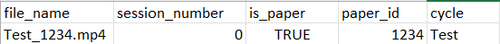
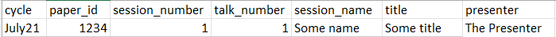
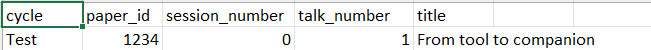
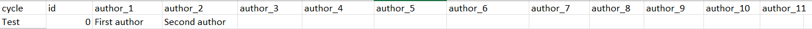

# cscw-bot Discord bot with automated broadcast notifications and automated streaming

## Description
Discord bot which automatically handles broadcasting announcements and scheduled video playback in VLC player with minimal user input required. 

### Features
- Sends announcements to a specified Discord channel whenever conference sessions are about to start
- Automatically plays conference videos for a session at scheduled times, with subtitles
- Announces presentation videos to individual session channels, including author and presenter info
- Allows videos playback order to be modified while script is running via a playlist file

## Setup
Run `pip install -r requirements.txt` to ensure that all dependencies are installed. 

Ensure that the files `papers.csv`, `playlist.csv`, and `sessions.csv` for the session and scheduling data are in a directory called 'scheduling' within the root directory. The format of these files is described in the section Metadata Files, further on in this readme. Also, ensure that video and subtitle files are in a directory called 'videos' in the root directory. See the section "Videos and Subtitle Files" for more info. Finally, the file `.env` must be present in the root directory (see the Settings section).

## Usage
To initiate the bot and automated playback, run `cscw-tv.py`. This will schedule Discord announcements and video playback to occur at the times specified in the timetable (`timetable.csv`). Note that this script should be kept running, otherwise the scheduled events will be cancelled. 

The videos to be played and the playback order can be modified by editing the `playlist.csv` file. Note that the playback order for a session **CANNOT** be changed once that session has started. The playlist file can be automatically generated, as described in "Generating the playlist file".

# Schedule Metadata Files
The following are required .csv files which must be present in the 'scheduling' directory. Note that they should be saved in UTF-8 comma-separated CSV format. It is recommended to edit these files in a text editor, as some editors (like Microsoft Excel) can mangle the cycle and date/time data:

- `playlist.csv`: File for controlling the order of the video playback.Includes video file names, associated session IDs. Also has field for marking paper presentation, and associated paper and cycle (only for paper presentations).  \

- `sessions.csv`: Contains the start datetime of each of the numbered sessions, index by session ID. This file contains a column for the session number, week 1 session time, and week 2 session time. Note that all datetimes are in UTC (24-hour format).\

- `papers.csv`: Contains paper info, which includes the paper names, conference cycle, paper IDs, and associated session ID. \

- `authors.csv`: Contains author info for each paper, which is limited to the first, middle, and last names of each author. Note that columns in this file must follow an `author_#` format, starting with the first author and including author names in linear order. \

## Generating the playlist file
For convenience, a playlist generator script (`playlist_generator.py`) is included within '/scripts'. This script writes a `playlist.csv` file to '/scheduling' with the required format. Requires `papers.csv` for paper data. Also requires submission info in `links.csv` (also contained in '/scheduling') to map submissions to papers. Also checks whether the required video files are present in '/videos'. 

# Video and Subtitle Files
Video and subtitle files must be included within the '/videos' directory. Video files should be in a .mp4 file format The file names should follow the following format **'cycle_paperid.mp4'**.

 The subtitles should be in a .srt format and must be present in the same directory as videos. Subtitle files must have identical file names to the corresponding video file.

# Discord integration
The system should be integrated with Discord, as described [here](https://discord.com/developers/docs/getting-started). 

## Settings
The following settings must be specified in `.env`. This file should not be included in source control, as it includes sensitive data:
- `TOKEN`: The private Discord bot token. 
- `TV_CHANNEL_ID`: The ID of the Discord channel where announcements about session will be sent when the session starts.